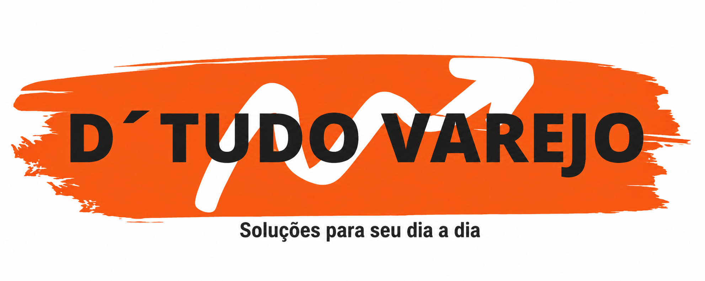

# Landing Page | D'Tudo Varejo

Landing page desenvolvida para a **D'Tudo Varejo**, uma loja de varejo com foco em produtos para casa, obra, reforma, utilidades, ferramentas, tintas, materiais elétricos e muito mais.

O projeto foi criado com foco em apresentação comercial, responsividade e conversão para contato via WhatsApp.

## 🔗 Site

https://dtudovarejo.com

## 🚀 Tecnologias utilizadas

- React
- Vite
- Tailwind CSS
- Framer Motion
- JavaScript

## 📌 Funcionalidades

- Layout responsivo para desktop, tablet e celular
- Hero section com destaque visual
- Vitrine de produtos
- Botões de contato via WhatsApp
- Seções comerciais para apresentação da loja
- Animações e microinterações
- Deploy com domínio próprio

## 🎯 Objetivo do projeto

Criar uma landing page moderna, profissional e direta para fortalecer a presença digital da D'Tudo Varejo e facilitar o contato dos clientes por meio do WhatsApp.

## 📷 Prévia



## 📁 Como rodar localmente

```bash
npm install
npm run dev
